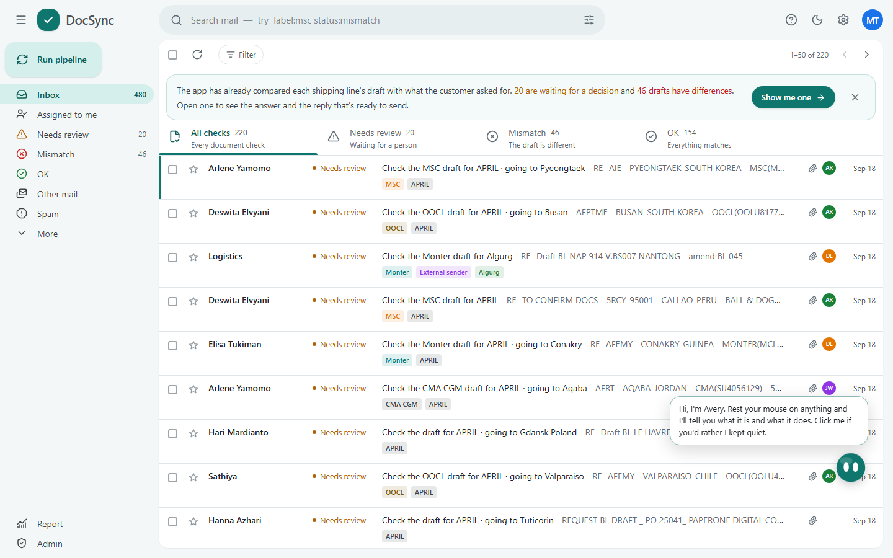

<p align="center">
  
</p>

<h1 align="center">DocSync</h1>
<p align="center">Your shipping desk's co-pilot. An inbox that checks the documents for you.</p>

<p align="center">
  <a href="https://doccheck-phi.vercel.app">Live demo</a> ·
  <a href="#what-it-does">Features</a> ·
  <a href="#run-it">Run it</a>
</p>

<p align="center">
  
  
  
</p>

## Introduction

Ever had to check a draft Bill of Lading against the customer's Shipping Instruction, one field at a time, for the tenth time today? One wrong digit in a weight slips through, and the amendment costs more than the check ever did. So I built DocSync: an inbox that reads both documents, compares the seven details that matter, and shows you the proof. Built for the Averis x Monash Hackathon 2026.

## What it does

- Sorts incoming mail into check requests, other mail and spam
- Tags every email by shipping line, customer and port, and the tags work as filters
- Compares the draft BL against the SI across seven required fields
- Gives one clear answer: OK, Mismatch or Needs review
- Shows both documents side by side with the exact difference highlighted
- Drafts the correction reply, ready to edit and send
- Asks a person when it is not sure, and says why, instead of guessing
- Lets the team correct a value, override a result or hand a case over, with every change logged
- Learns from the team's corrections, with an admin approving each rule
- Comes with Avery, an in-app guide that previews each email and explains every button
- Gives managers a report: what came in, what was found, where mistakes come from, and what the AI cost

## Technical highlight

Rules do the comparing, not the AI. Every value keeps its source location (file, page, position), so a mismatch can always be traced back to the exact spot in the original document. Weights, container counts, port names and company names are normalised first, so "40,326 KGS" and "40326 kg" never count as a difference. The AI is only used for the messy parts: unclear emails, odd layouts and previews. If it is off, the rules still finish the check.

## Tech stack

- Python, FastAPI, SQLite - pipeline and API
- React, TypeScript, Tailwind, Vite - the inbox
- PyMuPDF, openpyxl, python-docx, RapidOCR - reading PDF, Excel, Word and scans
- GPT-4o mini via OpenRouter - previews, second opinions and report summaries
- Vercel - hosting

## Run it

```bash
python -m venv .venv
.venv/Scripts/python -m pip install -r requirements-dev.txt
.venv/Scripts/python run.py
```

Open http://localhost:8000. Copy `.env.example` to `.env` and add an OpenRouter key to turn the AI parts on. Full docs, pipeline commands and design notes are in [docs/](docs/).

## License

[MIT](LICENSE)
